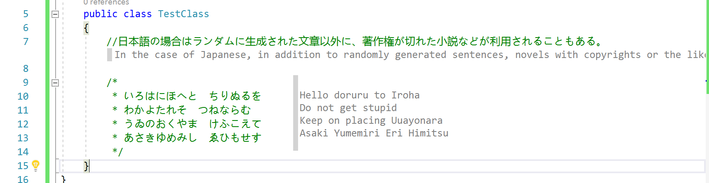
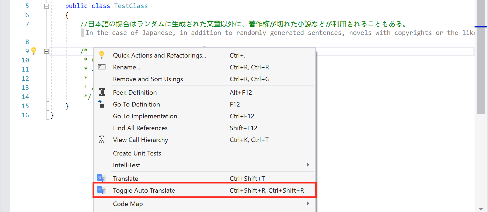
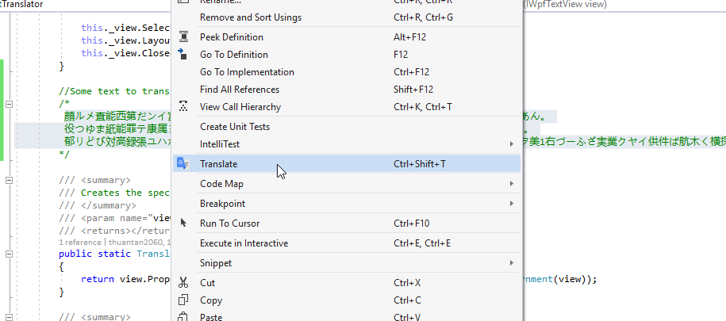
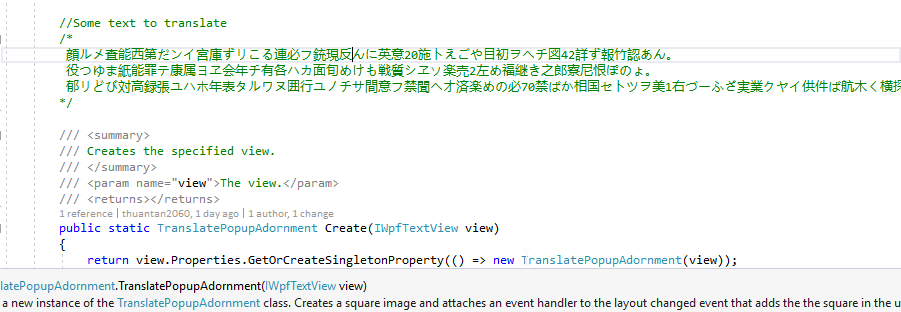
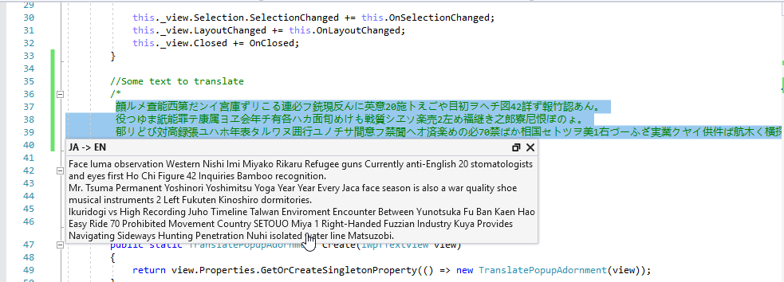
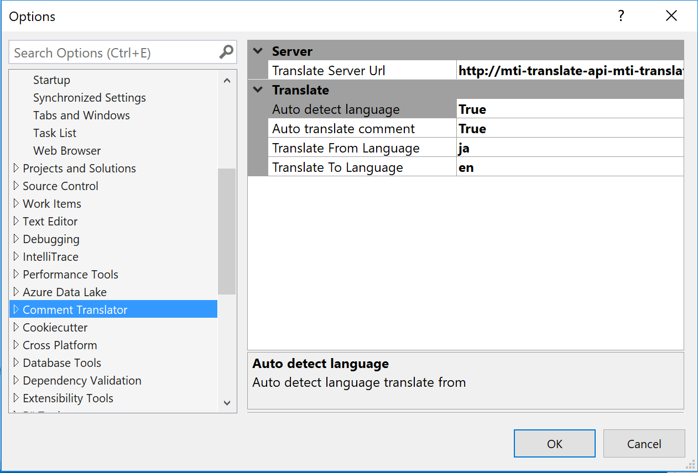

# Comment Translator

<!-- Update the VS Gallery link after you upload the VSIX-->
Download this extension from the [VS Gallery](https://visualstudiogallery.msdn.microsoft.com/b80c6a19-fea5-4abd-a394-84cf8a56ecc4)
or get the [CI build](http://vsixgallery.com/extension/c90fdb4d-7351-4205-9d62-159428df15d9/).

----------------------------------------

Extension of visual studio 2017 that automatic translate comment in you open file.

See the [change log](CHANGELOG.md) for changes and road map.

## Features

- Auto translate comment in opening file.
- Manual translate selected text with right-click (or Ctrl-Shift-T)

### Automatic translate comment in opening file
Commnent in you opening file will be translate to language you were setting.

#### Support Languages
  - CSharp
  - C/C++
  - FSharp
  - Visual Basic
  - Html
  - CSS
  - JavaScript/TypeScript
  - Xml
  - Xaml
  - Python
  - Razor
#### Toggle on/off
You can turn auto translate on/off by right click and choose in menu or use option page

### Manual translate selected text
Translate selected text by right-click or shortcut Ctrl-Shift-T

#### Auto select line if not selected text
- Not select text

- Auto selecte and translate line

#### Copy translated text by one-click

### Setting translate

## Contribute
Check out the [contribution guidelines](CONTRIBUTING.md)
if you want to contribute to this project.

For cloning and building this project yourself, make sure
to install the
[Extensibility Tools 2017](https://visualstudiogallery.msdn.microsoft.com/ab39a092-1343-46e2-b0f1-6a3f91155aa6)
extension for Visual Studio which enables some features
used by this project.

## License
[Apache 2.0](LICENSE)